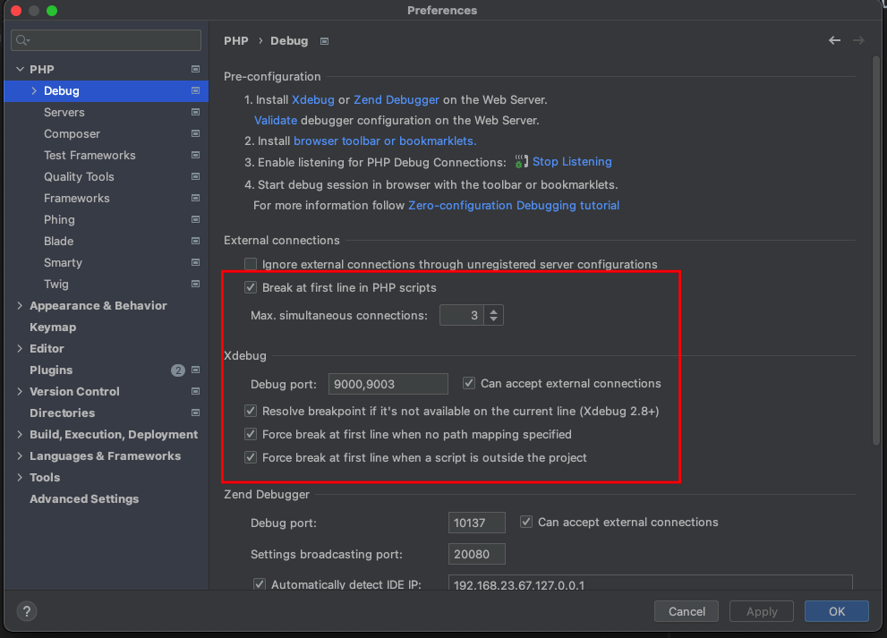
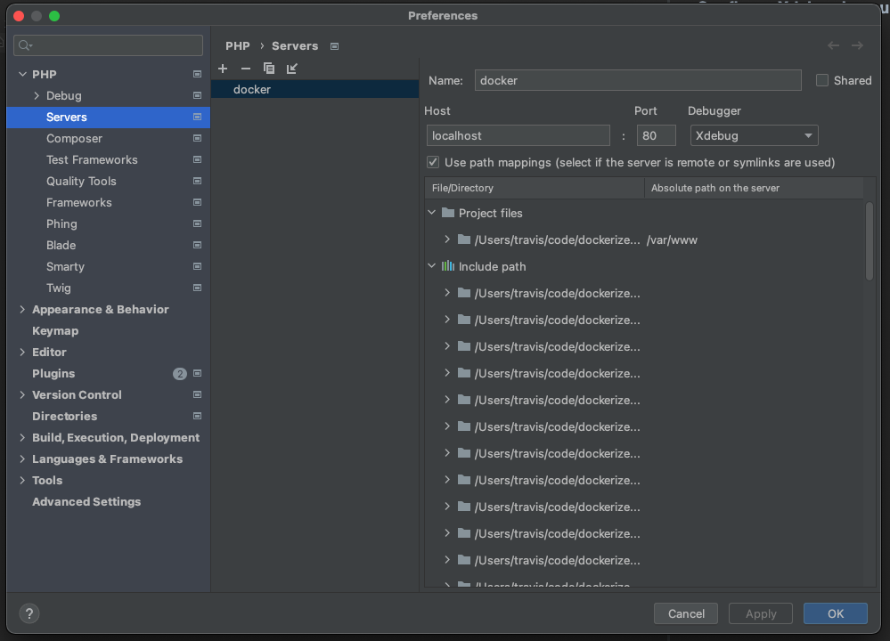
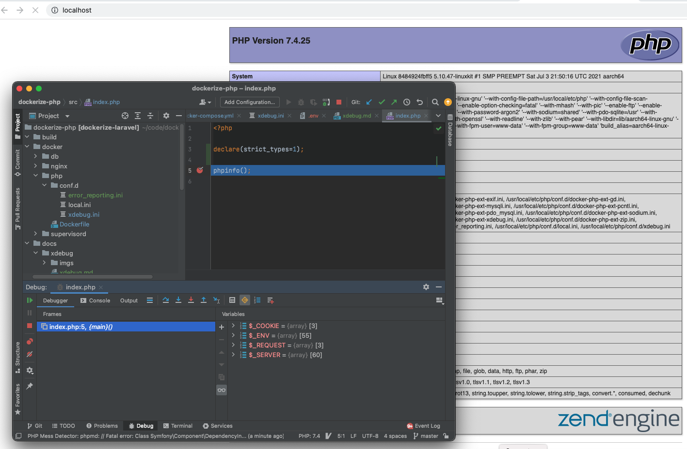

### Configure Xdebug in PHPSTORM

xDebug3 default port is `9003`

Do some modification in `docker/php/conf.d/xdebug.ini`

# How to Troubleshoot Xdebug if it doesn’t work

    xdebug_info();
    exit;
